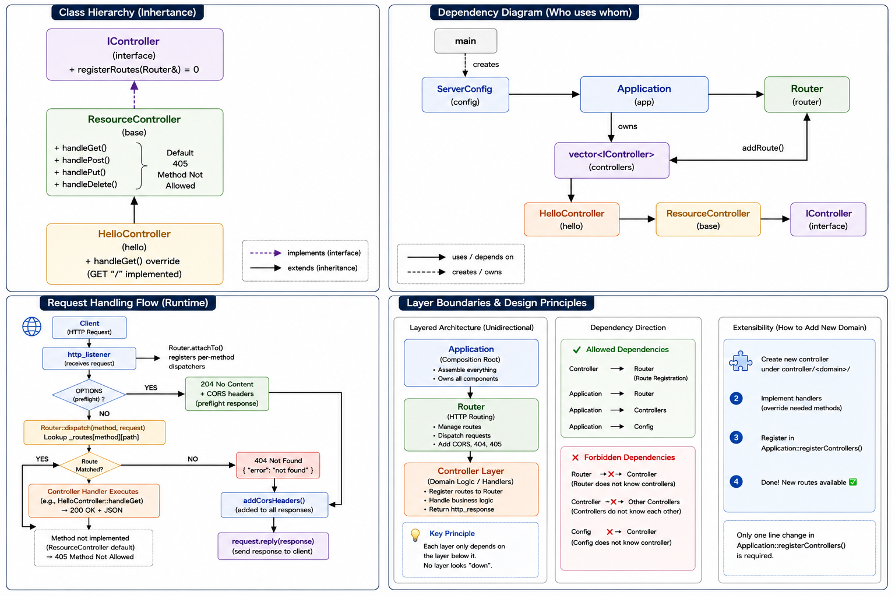

# cpprest-simple-server

Modern C++ REST API server powered by the Microsoft C++ REST SDK (cpprestsdk)

A lightweight, layered HTTP/JSON server built on `web::http::experimental::listener::http_listener`.

- Clean layered architecture (Config / Router / Controller / Application) with single-direction dependencies
- Abstract resource controller — derive and override only the HTTP verbs you need (GET / POST / PUT / DELETE)
- Central routing with built-in CORS preflight, JSON 404 / 405 responses
- Graceful shutdown that always releases the listening port (SIGINT / SIGTERM / SIGHUP)
- Self-contained dependency build — cpprest is built from a bundled tarball, no system-wide install required
- Designed for end-to-end solution
- Compatible with Ubuntu 22.04 or later

## Features

- **Layered Architecture**: Config, Router, Controller, and Application layers with clear, one-way boundaries
- **Abstract Resource Controller**: `ResourceController` exposes GET/POST/PUT/DELETE as virtual handlers; unimplemented verbs return `405 Method Not Allowed` automatically
- **Interface-driven Controllers**: `IController` interface lets each domain register its own routes (`controller/<domain>/`)
- **Central Dispatch**: `Router` maps `(method, path)` to handlers and applies cross-cutting concerns in one place
- **CORS Support**: Allow-all CORS headers on every response plus a global `OPTIONS` preflight handler
- **Consistent JSON Responses**: Structured JSON bodies for success, `404 Not Found`, and `405 Method Not Allowed`
- **Configurable Address**: Listen address/port via command-line argument (default `0.0.0.0:9000`)
- **Graceful Shutdown**: Termination signals close the listener cleanly so the port is released every time
- **Thread-safe by Design**: Stateless handlers and a read-only routing table after startup, leveraging cpprest's async I/O + thread pool
- **Self-contained Build**: `3rdparty/cpprest/build.sh` extracts and builds `libcpprest.so` (websockets excluded) and collects headers/libs locally

## Getting Started

### Prerequisites

- Linux (Ubuntu 22.04 or later)
- CMake 3.15 or later
- C++17 compiler (GCC 13+ recommended)
- Boost development libraries (`system`, `thread`, `chrono`)
- OpenSSL development libraries
- zlib development libraries
- C++ REST SDK (cpprestsdk 2.10.19) — bundled as a tarball under `3rdparty/cpprest/`, built locally (websockets excluded)

Install the system dependencies:

```bash
sudo apt-get update
sudo apt-get install -y build-essential cmake ninja-build \
    libboost-all-dev libssl-dev zlib1g-dev
```

### Build Instructions

#### 1. Build the cpprest dependency (once)

```bash
cd 3rdparty/cpprest
./build.sh
cd ../..
```

This extracts `cpprestsdk-2.10.19.tar.gz`, builds `libcpprest.so`, and collects the
results into `3rdparty/cpprest/include` and `3rdparty/cpprest/lib`.

#### 2. Build and run the server

```bash
# Clean -> configure -> build -> run
./build.sh
```

Or manually:

```bash
cmake -S . -B build
cmake --build build
./build/cpprest_simple_rest_server                         # default 0.0.0.0:9000
./build/cpprest_simple_rest_server http://127.0.0.1:8080/  # custom address
```

### Usage

```bash
# GET / -> 200 greeting
curl -s http://localhost:9000/

# All verbs (only GET is implemented; others return 405)
for m in GET POST PUT DELETE; do
  printf "%-7s -> " "$m"; curl -s -w " (HTTP %{http_code})\n" -X $m http://localhost:9000/
done

# CORS preflight
curl -i -X OPTIONS http://localhost:9000/
```

## API

| Method | Path | Description | Response |
|--------|------|-------------|----------|
| `GET` | `/` | Greeting message | `200` `{"message": "...", "path": "/"}` |
| `POST` / `PUT` / `DELETE` | `/` | Not implemented | `405` `{"error": "method not allowed"}` |
| `OPTIONS` | `*` | CORS preflight | `204` + CORS headers |
| any | unknown path | No matching route | `404` `{"error": "not found", "path": "..."}` |

## Project Structure

```
cpprest-simple-server/
├── 3rdparty/
│   └── cpprest/
│       ├── build.sh                        # Builds libcpprest.so from the tarball
│       └── cpprestsdk-2.10.19.tar.gz       # C++ REST SDK source (bundled)
│
├── src/
│   ├── main.cpp                            # Entry point: ServerConfig -> Application.run()
│   │
│   ├── app/                                # Application layer
│   │   ├── Application.cpp                  # Wires config/router/controllers, listener lifecycle
│   │   └── Application.h                    # Application interface
│   │
│   ├── config/                             # Configuration layer
│   │   ├── ServerConfig.cpp                # Listen address, argv parsing
│   │   └── ServerConfig.h                  # Config interface
│   │
│   ├── router/                             # Routing layer
│   │   ├── Router.cpp                       # (method, path) -> handler, dispatch, CORS, 404
│   │   └── Router.h                         # Router interface, route_handler_t alias
│   │
│   └── controller/                         # Controller layer
│       ├── interface/
│       │   └── IController.h                # Controller interface (registerRoutes)
│       ├── base/
│       │   ├── ResourceController.cpp       # GET/POST/PUT/DELETE abstraction, default 405
│       │   └── ResourceController.h         # Base controller interface
│       └── hello/
│           ├── HelloController.cpp          # GET "/" greeting (overrides handleGet)
│           └── HelloController.h            # Hello controller interface
│
├── CMakeLists.txt                          # Build configuration (Linux, cpprest linkage)
└── build.sh                                # Clean -> configure -> build -> run
```

## Architecture



```
                          ┌──────────────┐
                          │     main     │
                          └──────┬───────┘
                                 │ creates ServerConfig, runs Application
                                 ▼
   ┌───────────────────────────────────────────────────────────────┐
   │                        Application                              │
   │   - registerControllers()   - listener open / wait / close     │
   │   - signal handling (SIGINT / SIGTERM / SIGHUP)                 │
   └───────────────┬─────────────────────────────┬─────────────────┘
                   │ owns                         │ owns
                   ▼                              ▼
          ┌─────────────────┐            ┌──────────────────────────┐
          │   ServerConfig  │            │         Router           │
          │  (listen addr)  │            │  (method,path)->handler  │
          └─────────────────┘            │  dispatch + CORS + 404   │
                                         └────────────┬─────────────┘
                                                      │ addRoute()
                          ┌───────────────────────────┴───────────────┐
                          │              Controllers                   │
                          │   IController  ◀── ResourceController      │
                          │                       ▲ (GET/POST/PUT/DEL) │
                          │                       │ extends            │
                          │                  HelloController           │
                          └───────────────────────────────────────────┘

   Request flow:
   client ─▶ http_listener ─▶ Router.dispatch ─▶ Controller handler
                                   │                    │
                                   ├─ OPTIONS ─▶ 204 + CORS (preflight)
                                   ├─ no match ─▶ 404 JSON
                                   └─ http_response ─▶ addCorsHeaders ─▶ reply
```

### Key Components

1. **main**: Builds `ServerConfig` from argv, constructs and runs `Application`.
2. **Application**: Assembles config, router, and controllers; owns the HTTP listener lifecycle and shutdown signals.
3. **ServerConfig**: Holds the listen address and parses command-line arguments.
4. **Router**: Maps `(method, path)` to handlers, dispatches requests, and injects CORS headers / 404 responses centrally.
5. **Controllers**: `IController` defines the contract; `ResourceController` abstracts the four HTTP verbs (default `405`); domain controllers (e.g. `HelloController`) override only what they support.

## Adding a New Controller

1. Create `src/controller/<domain>/<Name>Controller.{h,cpp}` deriving from `ResourceController`.
2. Pass the route path to the base constructor and override the verbs you support.
3. Register it in `Application::registerControllers()` (one `push_back`).
4. Add the new source/include paths to `CMakeLists.txt`.

## Commit Convention

Commit messages use an uppercase prefix followed by a period: `FEAT.`, `ADD.`, `CHANGE.`,
`FIXED.`, `UPDATE.`, `DELETE.` — e.g. `FEAT. Add user resource controller`.

## License

This project is licensed under the MIT License - see the [LICENSE](LICENSE) file for details.
